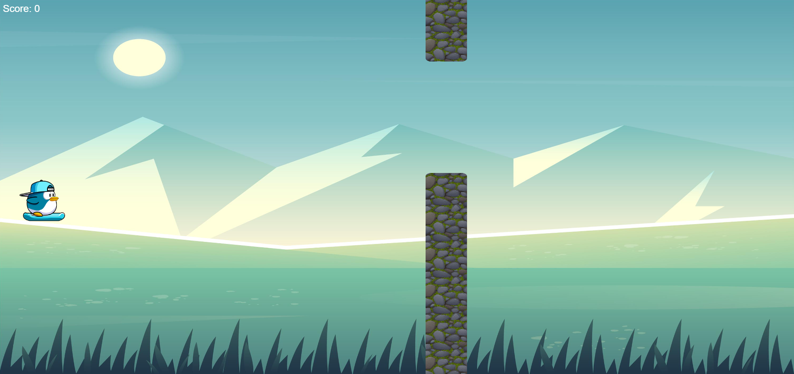

# Flipper
Flipper é um jogo simples e divertido, inspirado no clássico *Flappy Bird*. Este jogo será usado como parte do meu portfólio de desenvolvimento de software, com foco em práticas de arquitetura monolítica, ECM e Front-end com Vanilla JS.

## Como Rodar o Jogo

### Requisitos

1. Um navegador moderno (Google Chrome, Firefox, etc.).
2. Arquivos do jogo localmente ou acessíveis por meio de um servidor web.

### Passos para Execução

1. Clone o repositório:
   git clone <URL_DO_REPOSITORIO>
   cd Flipper

2. Abra o arquivo index.html em seu navegador ou utilize um servidor local (como o http-server) para rodar o jogo.
3. Após isso é só clicar no botão "Start Game" que o jogo será iniciado.
4. Para controlar o Player, basta apertar a tecla "Espaço" se estiver no Computador ou "Tocar" na tela se estiver utilizando um celular.

## Arquitetura

### Arquitetura Monolítica

Devido ao porte pequeno do projeto, foi escolhida uma **arquitetura monolítica**, onde toda a aplicação reside em um único servidor. Caso haja necessidade de escalabilidade no futuro, o servidor poderá ser escalado horizontalmente para atender à demanda.

### Padrão de Arquitetura: ECM

O padrão de arquitetura adotado é o **ECM** (Entity-Component-Manager), uma abordagem eficiente para separar entidades, componentes e o gerenciamento de lógica do jogo.

## Estrutura de Diretórios

A estrutura de diretórios está organizada da seguinte forma:

assets  
  ├── images                // Imagens do jogo e Readme.md
  └── sound                 // Sons e músicas do jogo  

src  
  ├── entities              // Entidades do jogo (e.g., jogador, obstáculos)  
  ├── ecm-components        // Componentes ECM (e.g., gravidade, posição)  
  ├── managers              // Gerenciadores de comportamento (e.g., pontuação, física)  
  ├── utils                 // Funções auxiliares (e.g., cálculos de física)  
  ├── game.js               // Inicialização e controle global do jogo  
  ├── styles                // Arquivos de estilo do jogo  
tests  
  └── game.test.js          // Testes unitários para a lógica do jogo  

index.html                 // Ponto de entrada do navegador  
README.md                  // Documentação do jogo  

### Detalhamento dos Componentes

- **`/assets`**: Contém todos os elementos gráficos e sonoros necessários para o jogo, organizados em subpastas para imagens e sons.
- **`/entitys`**: Armazena as entidades do jogo
- **`/ecm-components`**: Contém os componentes responsáveis pela lógica de interação do jogo, como o controle do movimento do personagem,obstáculos, gravidade e etc...
- **`game.js`**: O coração do jogo, que gerencia toda a lógica e o fluxo do jogo, como detecção de colisões, pontuação e fim do jogo.
- **`index.html`**: O ponto de entrada do jogo, onde a interface do navegador é configurada e inicializada.
  
## Como Rodar o Jogo

### Requisitos

1. Um navegador moderno (Google Chrome, Firefox, etc.).
2. Arquivos do jogo localmente ou acessíveis por meio de um servidor web.

### Passos para Execução

1. Clone o repositório:
   git clone <URL_DO_REPOSITORIO>
   cd Flipper

2. Abra o arquivo index.html em seu navegador ou utilize um servidor local (como o http-server) para rodar o jogo.

### Licença
- Este projeto está sob a Licença MIT.

## Padrões de Commits para serem seguidos

### Adicionar uma nova funcionalidade:
Formato: feat: <descrição>
Exemplo: feat: adicionar componente de física para gravidade

### Corrigir um bug:
Formato: fix: <descrição>
Exemplo: fix: corrigir erro ao adicionar componente duplicado

### Alteração de estilo ou formatação (sem alterar a lógica):
Formato: style: <descrição>
Exemplo: style: ajustar indentação do código

### Refatoração do código (sem alterar o comportamento):
Formato: refactor: <descrição>
Exemplo: refactor: refatorar função de cálculo de pontuação

### Documentação:
Formato: docs: <descrição>
Exemplo: docs: atualizar README com instruções de execução

### Alteração em arquivos de configuração:
Formato: chore: <descrição>
Exemplo: chore: atualizar configuração do Webpack

### Testes:
Formato: test: <descrição>
Exemplo: test: adicionar testes para componentes da física